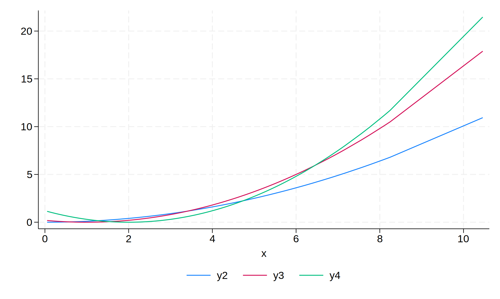
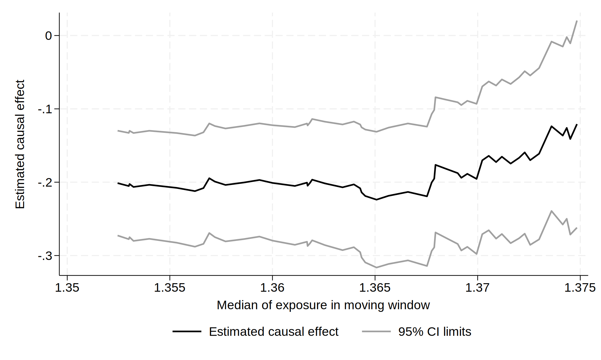

```{r, include=FALSE}
library(Statamarkdown)
```

```{stata, include=FALSE, collectcode=TRUE}
adopath ++ ..
```

Read in simulated data with different outcome-exposure relationships; `y#` outcome, `x` exposure, `g` instrumental variable (genotype).
```{stata, collectcode=TRUE, results='hide'}
use ../data/ivmwdata, clear
```

Plot outcome-exposure relationships
```{stata, results=FALSE}
twoway line y1 x, sort(x)
qui gr export ./img/ivmw-plot-01.svg, replace
```
```{r, echo=FALSE, fig.align='center', fig.alt="Plot of relationship between y1 and x."}
knitr::include_graphics("./img/ivmw-plot-01.svg")
```
```{stata, results=FALSE}
twoway line y2 y3 y4 x, sort(x)
qui gr export ./img/ivmw-plot-02.svg, replace
```
```{r, echo=FALSE, fig.align='center', fig.alt="Plot of relationships between y2, y3, y4, and x."}

```
```{stata, results=FALSE}
twoway line y5 x, sort(x)
qui gr export ./img/ivmw-plot-03.svg, replace
```
```{r, echo=FALSE, fig.align='center', fig.alt="Plot of relationship between y5 and x."}
knitr::include_graphics("./img/ivmw-plot-03.svg")
```
    
Example moving window fits.
```{stata}
ivmw, window(3950) par(x): ivreg2 y1 (x = g)
qui gr export ./img/ivmw-plot-04.svg, replace
```
```{r, echo=FALSE, fig.align='center', fig.alt="Plot of estimated causal effect versus the median of the exposure in the moving window."}
knitr::include_graphics("./img/ivmw-plot-04.svg")
```
```{stata}
ivmw, window(3950) par(x): ivreg2 y2 (x = g)
qui gr export ./img/ivmw-plot-05.svg, replace
```
```{r, echo=FALSE, fig.align='center', fig.alt="Plot of estimated causal effect versus the median of the exposure in the moving window."}
knitr::include_graphics("./img/ivmw-plot-05.svg")
```
```{stata}
ivmw, window(3950) par(x): ivreg2 y3 (x = g)
qui gr export ./img/ivmw-plot-06.svg, replace
```
```{r, echo=FALSE, fig.align='center', fig.alt="Plot of estimated causal effect versus the median of the exposure in the moving window."}
knitr::include_graphics("./img/ivmw-plot-06.svg")
```
```{stata}
ivmw, window(3950) par(x): ivreg2 y4 (x = g)
qui gr export ./img/ivmw-plot-07.svg, replace
```
```{r, echo=FALSE, fig.align='center', fig.alt="Plot of estimated causal effect versus the median of the exposure in the moving window."}

```
```{stata}
ivmw, window(3950) par(x): ivreg2 y5 (x = g)
qui gr export ./img/ivmw-plot-08.svg, replace
```
```{r, echo=FALSE, fig.align='center', fig.alt="Plot of estimated causal effect versus the median of the exposure in the moving window."}
knitr::include_graphics("./img/ivmw-plot-08.svg")
```

Change window size (e.g. for outcome y2).
```{stata, eval=FALSE}
ivmw, window(3750) par(x): ivreg2 y2 (x = g)
ivmw, window(3000) par(x): ivreg2 y2 (x = g)
ivmw, window(2000) par(x): ivreg2 y2 (x = g)
ivmw, window(1000) par(x): ivreg2 y2 (x = g)
```

Save the moving window dataset.
```{stata, eval=FALSE}
ivmw, window(3950) par(x) saving(ivmw): ivreg2 y2 (x = g)
```

Use different iv commands.
```{stata, eval=FALSE}
ivmw, window(3950) par(x): ivregress 2sls y (x = z1 z2 z3)
ivmw, window(3950) par(x): ivregress liml y (x = z1 z2 z3)
ivmw, window(3950) par(x): ivregress gmm y (x = z1 z2 z3)
ivmw, window(3950) par(x): ivlsmm y (x = z1 z2 z3)
ivmw, window(3950) par(x): ivmsmm y (x = z1 z2 z3)
ivmw, window(3950) par(b1): ivtsps y (x = z1 z2 z3)
ivmw, window(3950) par(b1): ivtsps y (x = z1 z2 z3), link(logadd)
ivmw, window(3950) par(b1): ivtsps y (x = z1 z2 z3), link(logmult)
ivmw, window(3950) par(b1): ivtsps y (x = z1 z2 z3), link(logit)
ivmw, window(3950) par(b1): ivtsri y (x = z1 z2 z3)
ivmw, window(3950) par(b1): ivtsri y (x = z1 z2 z3), link(logadd)
ivmw, window(3950) par(b1): ivtsri y (x = z1 z2 z3), link(logmult)
ivmw, window(3950) par(b1): ivtsri y (x = z1 z2 z3), link(logit)
```
