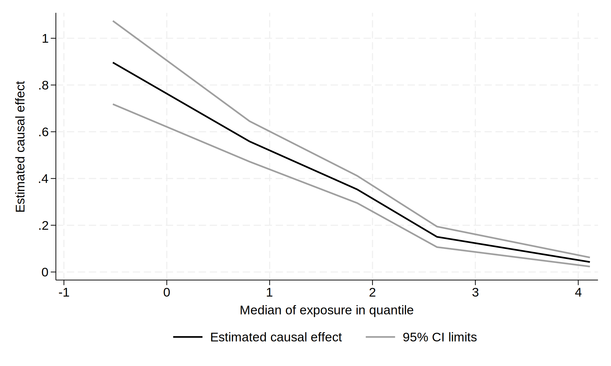

```{r, include=FALSE}
library(Statamarkdown)
```

```{stata, include=FALSE, collectcode=TRUE}
adopath ++ ..
```

Read in simulated data with different outcome-exposure relationships; `y#` outcome, `x` exposure, `g` instrumental variable (genotype).
```{stata, collectcode=TRUE, results=FALSE}
use ../data/ivmwdata, clear
```

Plot outcome-exposure relationships
```{stata, eval=FALSE}
twoway line y1 x, sort(x)
```
```{r, echo=FALSE, fig.align='center', fig.alt="Plot of relationship between y1 and x."}
knitr::include_graphics("./img/ivmw-plot-01.svg")
```
```{stata, eval=FALSE}
twoway line y2 y3 y4 x, sort(x)
```
```{r, echo=FALSE, fig.align='center', fig.alt="Plot of relationships between y2, y3, y4, and x."}
knitr::include_graphics("./img/ivmw-plot-02.svg")
```
```{stata, eval=FALSE}
twoway line y5 x, sort(x)
```
```{r, echo=FALSE, fig.align='center', fig.alt="Plot of relationship between y5 and x."}
knitr::include_graphics("./img/ivmw-plot-03.svg")
```

Use with different iv commands.
```{stata}
ivxtile, nq(5) par(x): ivregress 2sls y2 (x = g)
qui gr export ./img/ivxtile-plot-01.svg, replace
```
```{r, echo=FALSE, fig.align='center', fig.alt="Plot of estimated causal effect versus median of exposure in quantile."}
knitr::include_graphics("./img/ivxtile-plot-01.svg")
```
```{stata}
ivxtile, nq(10) par(b1): ivtsps y2 (x = g)
qui gr export ./img/ivxtile-plot-02.svg, replace
```
```{r, echo=FALSE, fig.align='center', fig.alt="Plot of estimated causal effect versus median of exposure in quantile."}
knitr::include_graphics("./img/ivxtile-plot-02.svg")
```    

Some binary outcome examples.
```{stata, collectcode=TRUE, results='hide'}
use ../data/ivbinoutdata, clear
```
```{stata}
ivxtile, nq(5) par(b1): ivtsps y (x = z1 z2 z3), link(logadd)
qui gr export ./img/ivxtile-plot-03.svg, replace
```
```{r, echo=FALSE, fig.align='center', fig.alt="Plot of estimated causal effect versus median of exposure in quantile."}

```
```{stata, eval=FALSE}
ivxtile, nq(5) par(b1): ivtsps y (x = z1 z2 z3), link(logmult)
ivxtile, nq(5) par(b1): ivtsps y (x = z1 z2 z3), link(logit)
ivxtile, nq(5) par(b1): ivtsri y (x = z1 z2 z3), link(logadd)
ivxtile, nq(5) par(b1): ivtsri y (x = z1 z2 z3), link(logmult)
ivxtile, nq(5) par(b1): ivtsri y (x = z1 z2 z3), link(logit)
ivxtile, nq(5) par(x): ivlsmm y (x = z1 z2 z3)
ivxtile, nq(5) par(x): ivmsmm y (x = z1 z2 z3)
```

Save the dataset of results.
```{stata, eval=FALSE}
ivxtile, nq(10) par(x) saving(ivxtileres): ivreg2 y2 (x = g)
```
